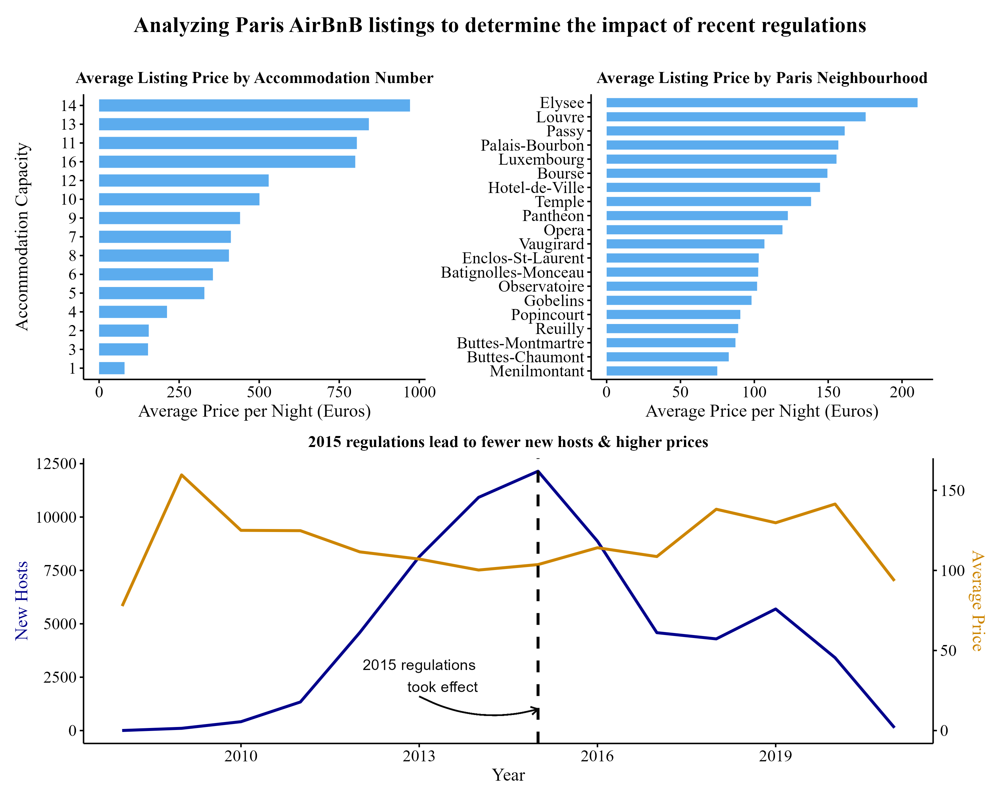

# AirBnB Listing Analysis
#### This project analyzes AirBnB listings in Paris to determine the impact of the 2015 regulations.
#### [Full Analysis](https://darakhshannehal.quarto.pub/airbnb-listing-analysis/)

#### Key Findings:

* **Neighborhood Analysis:** Elysee has the highest average listing prices.

* **Accommodation Analysis:** Higher accommodation capacity generally leads to higher prices.

* **Impact of Regulations:** The 2015 regulations resulted in fewer new hosts and higher prices.

* **Temporal Trends:** The number of new hosts peaked prior to the 2015 regulations and declined afterward, while average listing prices have generally trended upwards.

#### Graphic
Key trends identified using R and its visualization libraries are presented in the following one-page graphic

